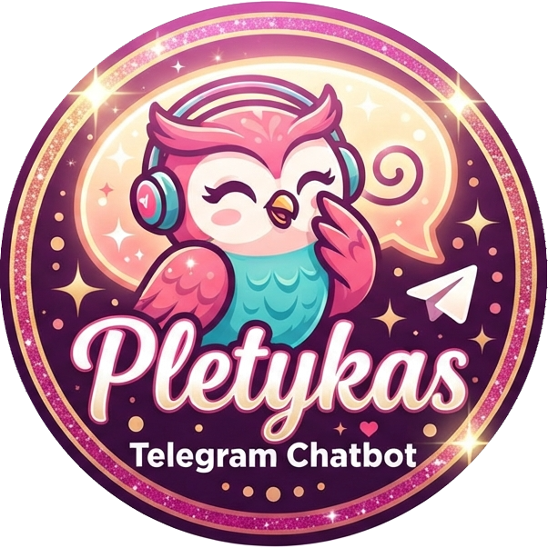

# Pletykas Telegram Bot

<p align="center">
  
</p>

An autonomous, multi-modal Telegram group chatbot designed to seamlessly integrate into group discussions as a witty, observant, and subtly gossipy participant.

## Key Features

- **Single Group Restriction**: Locks exclusively to an authorized `GROUP_CHAT_ID`. If added to unauthorized chats, it logs an alert and leaves automatically.
- **Strict Private Admin Interface**: Administrative slash commands are only accepted in private chats with authorized `ADMIN_USERIDS`.
- **Pure LLM Autonomy**: Decides dynamically whether to reply, react with an emoji, request image generation/editing, or remain silent (`<NO_REPLY>`).
- **Debounced Cooldown Timer**: Rapid consecutive messages reset a debounce timer (`cooldown_sec`), batching human chatter into a cohesive context before model evaluation.
- **Multimodal Image Support**: Ingests photos directly, generates visual descriptions, and supports text-to-image and image-to-image editing using `<GENERATE_IMAGE>`.
- **Dynamic Memory Management**: Automatically distills facts, group dynamics, and inside jokes every 20 messages into `pletykas-memory.json` with rolling `.bak` backups.
- **Quiet Hours & Chat Revival**: Optional sleep schedule (`/sleep`) and unprompted conversational revival with polls or banter (`/spontaneous`).
- **Capability Escalation & Retry**: The fast primary model automatically escalates to the large model (`<RETRY_WITH_LARGE_MODEL>`) when real-time web search or capabilities beyond its reach are needed.

---

## Architecture & Models

- **Primary Conversational Model** (`MODEL_NAME`): Default `deepseek-flash` (or Google Gemini/Gemma models).
- **Vision Model** (`MODEL_LARGE_NAME`): Default `gemini-flash-latest` for high-fidelity photo captioning and visual descriptions.
- **Image Generation Model** (`MODEL_IMAGE_NAME`, `MODEL_IMAGE_SIZE`): Default `gemini-3.1-flash-lite-image` (or OpenAI DALL-E / compatible image endpoints), default size `1K`.

---

## Quick Start

### 1. Configuration

Copy the example configuration file:
```bash
cp config.inc.sh-example config.inc.sh
```

Edit `config.inc.sh` with your credentials:
```bash
BOT_TOKEN="123456789:ABCdefGhIJKlmNoPQRsTUVwxyZ"
GROUP_CHAT_ID="-1001234567890"
ADMIN_USERIDS="12345678,98765432"

MODEL_NAME="deepseek-flash"
MODEL_API_KEY="your-deepseek-or-llm-api-key"
MODEL_API_BASE="https://api.deepseek.com"
MODEL_THINKING_LEVEL="" # Empty instructs model not to think (default); or minimal, low, medium, high, budget

MODEL_LARGE_NAME="gemini-flash-latest"
MODEL_LARGE_API_KEY="your-gemini-api-key"
MODEL_LARGE_API_BASE=""
MODEL_LARGE_THINKING_LEVEL=""

MODEL_IMAGE_NAME="gemini-3.1-flash-lite-image"
MODEL_IMAGE_API_KEY="your-gemini-api-key"
MODEL_IMAGE_API_BASE=""
MODEL_IMAGE_SIZE="1K"
MODEL_IMAGE_THINKING_LEVEL=""
```

### 2. Run Locally

Execute `run.sh` to initialize the virtual environment, install dependencies, and start the bot:
```bash
./run.sh
```

### 3. Containerized Deployment

Build and run using Podman or Docker:
```bash
./01-buildah-image.sh
podman run -d --name pletykas-telegram-bot --env-file config.inc.sh pletykas-telegram-bot:latest
```

---

## Administrative Commands (Private Chat Only)

| Command | Arguments | Description |
| :--- | :--- | :--- |
| `/start`, `/help` | — | Displays formatted command overview |
| `/status` | — | Shows active parameters, uncurated message stats, and model settings |
| `/talkativeness` | `[1-10]` | Views or adjusts autonomous conversation entry frequency |
| `/cooldown` | `[sec]` | Views or adjusts debounce delay (in seconds; 0 disables) |
| `/nicknames` | `[nick1, nick2...]` | Views, sets, or clears comma-separated direct trigger nicknames |
| `/language` | `[lang]` | Views or updates active conversation language (e.g. `English`, `Hungarian`) |
| `/timezone` | `[tz]` | Views or sets the IANA timezone (e.g. `Europe/Budapest`) |
| `/sleep` | `[on\|off] [start] [end]` | Configures quiet hours (e.g. `/sleep on 23:00 07:00`) |
| `/spontaneous` | `[on\|off\|now]` | Enables, disables, or views periodic spontaneous messages |
| `/spontaneous_interval` | `[min] [max]` | Views or adjusts the random timer interval in hours (default: `2 4`) |
| `/spontaneous_now` | — | Instantly generates and dispatches a spontaneous message or poll to the group |
| `/prompt` | `[load\|reset]` | Uploads system prompt file as-is, expects a text file upload to replace prompt, or resets to default |
| `/grounding` | `[on\|off]` | Toggles Google Search grounding tool |
| `/image_large` | `[on\|off]` | Toggles large model for image interpretation (default: `ON` instant large model; `OFF` tries small model first) |
| `/debug` | `[on\|off]` | Toggles debug streaming to stdout (raw LLM payloads and Telegram group messages) |
| `/memories` | `[load]` | Uploads memories JSON file as-is, or enters waiting mode to validate and load an uploaded JSON file |
| `/cancel` | — | Aborts a pending memories or prompt file upload |
| `/curate` | — | Manually triggers immediate LLM reflection and consolidation |

---

## Testing

Run the automated test suite with pytest:
```bash
.venv/bin/pytest -v
```
All 63 unit, integration, and smoke tests will execute against local mocks without requiring live API keys.

## Contributors

- Norbert Varga [nonoo@nonoo.hu](mailto:nonoo@nonoo.hu)

## Donations

If you find this bot useful then [buy me a beer](https://paypal.me/ha2non). :)

## License

[MIT](LICENSE)
